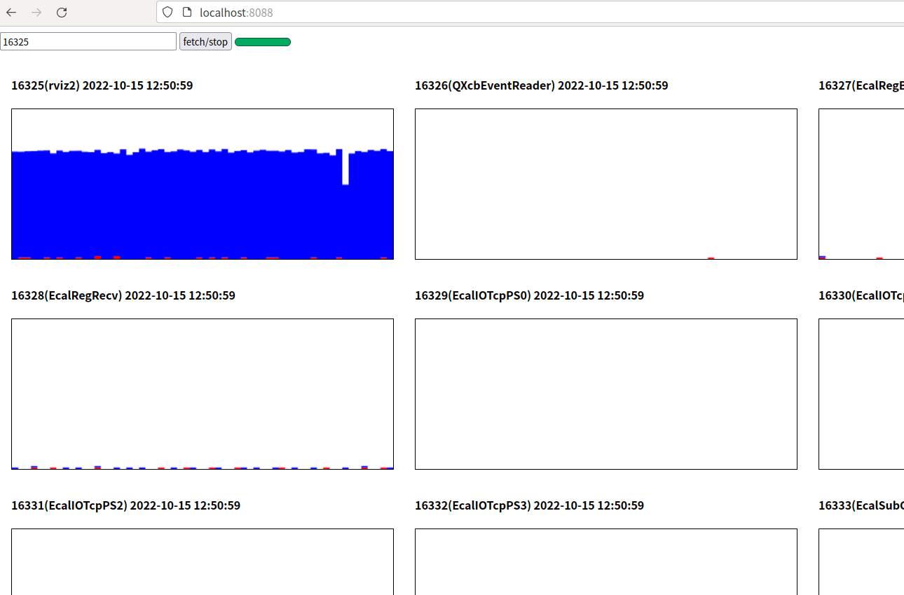

# Thread Mode H5 Top
Render `top -H` with timeline in your web browser. 

Personally used together with [pstack](https://github.com/peadar/pstack) to analysis heavy threaded
process.

## legend:
* blue: user space thread cpu usage
* red:  kernel space thread cpu usage

