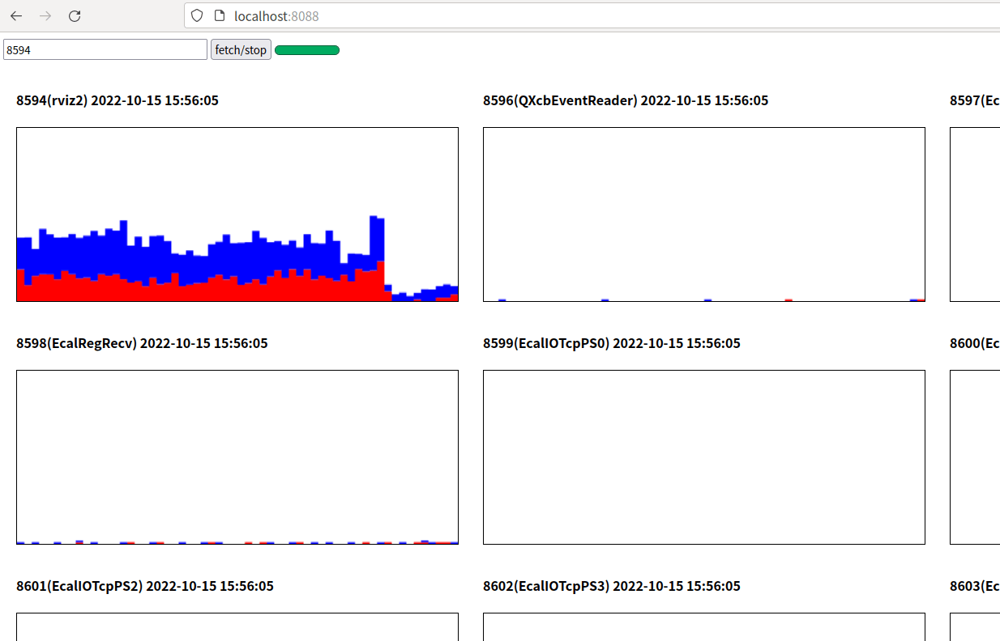

# Thread Mode H5 Top
Render `top -H` with timeline in your web browser, aka monitoring single process's threads cpu usage
in web browser.

Personally used together with [pstack](https://github.com/peadar/pstack) to analysis heavy threaded
process.

## Legend
* blue: user space thread cpu usage
* red:  kernel space thread cpu usage

## How to run it
1. clone this repo to any place
2. make sure node.js is installed and then `node app.js`
3. navigate to localhost:8089 in your web browser, type process short name(such as `firefox`) and
   press enter
